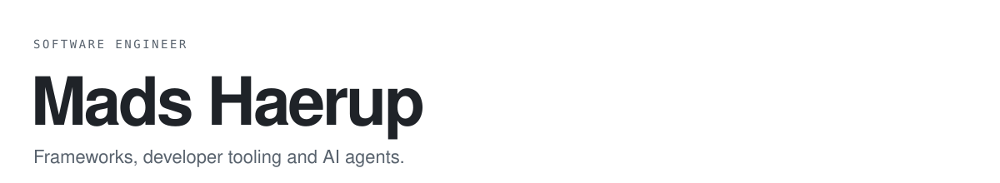

<picture>
  <source media="(prefers-color-scheme: dark)" srcset="assets/header-dark.svg" />
  
</picture>

 

Hi, I'm Mads. Most of what I build in the open lives under [useAvalon](https://github.com/useAvalon).

## Building

<table>
  <tr>
    <td width="50%" valign="top">
      <h3><a href="https://github.com/useAvalon/Avalon">Avalon</a></h3>
      
The full-stack islands framework. Zero JavaScript by default, partial hydration per island, and React, Vue, Svelte, Solid, Preact, Qwik and Lit on the same route.

      
<code>bun create avalon</code>

      
<a href="https://useavalon.dev">useavalon.dev</a> · <a href="https://useavalon.dev/docs/introduction">Docs</a>

    </td>
    <td width="50%" valign="top">
      <h3><a href="https://github.com/useAvalon/caelence-agent">Caelence agent</a></h3>
      
Open source coding-agent harness with a terminal UI and a desktop app. Skills, evals, MCP and approval gates, on any OpenRouter model.

      
<code>bunx --bun @useavalon/caelence-agent</code>

      
<a href="https://www.npmjs.com/package/@useavalon/caelence-agent">npm</a> · MIT

    </td>
  </tr>
</table>

## Stack

 
 

